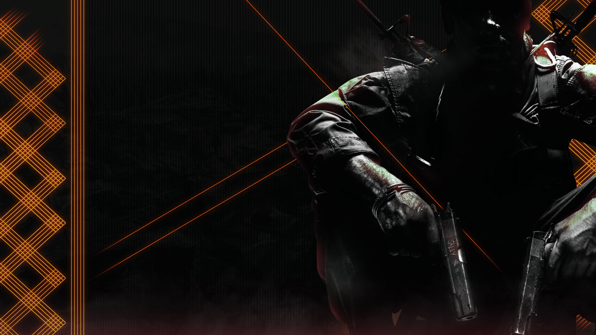

# Plutonium-T5-Scripts

## What is this?

This is a collection of [Plutonium](https://plutonium.pw/docs/intro/) T5/BO1 scripts I created, written in [GSC](https://plutonium.pw/docs/modding/gsc/).  

Huge thanks to everyone who helped me learn GSC: Birchy, DoktorSAS, FutureRave and other people on Discord.

## How do I download a script?

Click on a `.gsc` file and click on `Raw`.

  
Image

  
  
  

Right click anywhere and click on `Save page as` (or an equivalent).  

Make sure to put `All` or `Any` for the file type and to add `.gsc` at the end of the file name.

  
Image

  
  

## How do I use a script?

Open the start menu and go to `%localappdata%\Plutonium\storage\t5`.  
If the script should be loaded for both the multiplayer and the zombies mode then drop the file in the `scripts` folder.  
If the script should only be loaded for the multiplayer mode then put it in `scripts\mp`.  
If the script should only be loaded for the zombies mode then put it in `scripts\sp\zom`.  

Note that you can use `map_restart` in the [console](https://plutonium.pw/docs/opening-console/) to quickly restart your current game and reload scripts.
